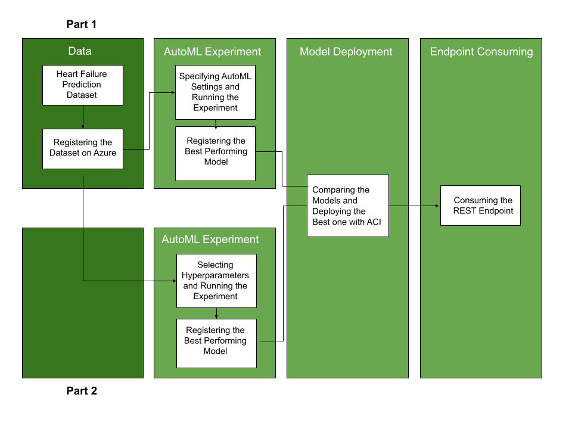
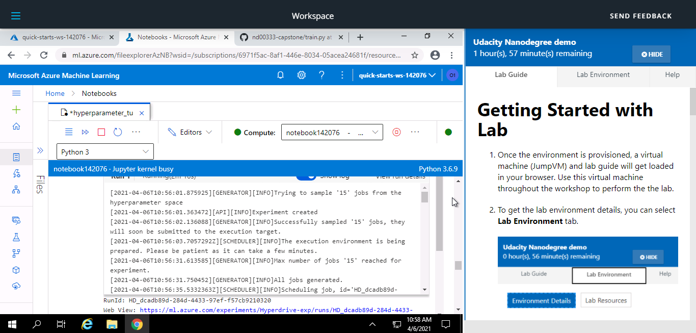
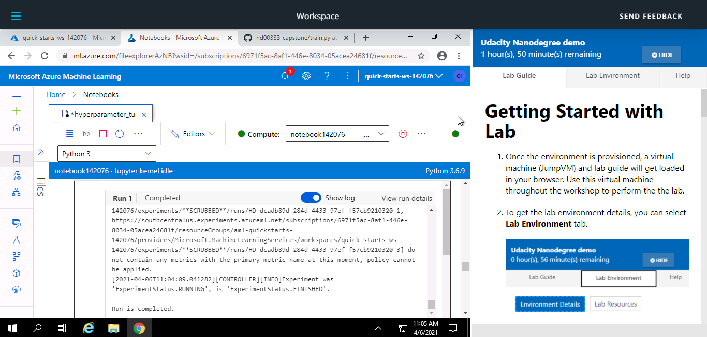
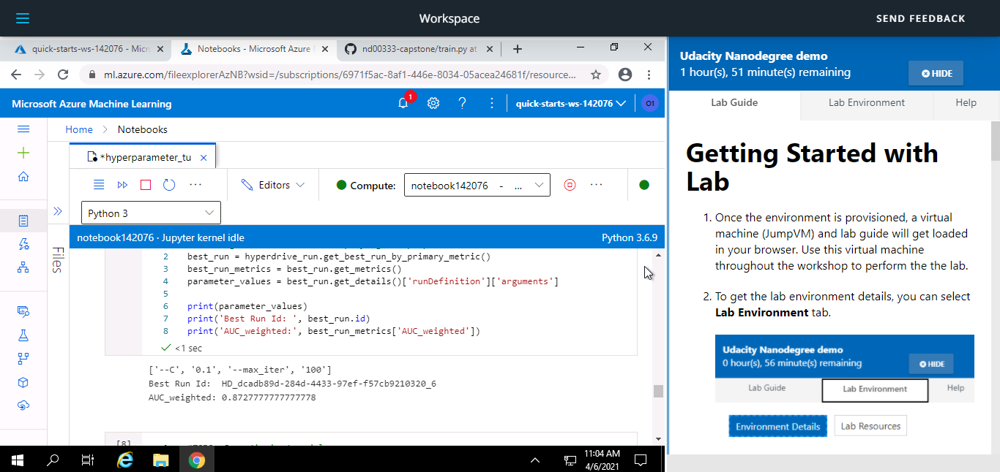

# Capstone Project - Azure Machine Learning Engineer

The aim of the project is to create two models, compare their performance, deploy the best performing model as a webservice and test the model's endpoint. The first model was trained using Automated ML and the second one  was created by  hyperparameter tuning using HyperDrive. 



## Dataset

### Overview
The "Heart Failure Prediction" dataset from Kaggle was used. The dataset contains 12 clinical features of 299 patients with heart failure and a target variable "DEATH EVENT" indicating if the patient deceased during the follow-up period (Boolean). Machine Learning can help detect and manage high-risk patients at an earlier stage.

### Task
The task was to detect the high-risk patients. To solve this binary classification problem, the 12 features were used to predict possible death events with the help of an ML algorithm. 
The 12 clinical features: age, anaemia, diabetes, creatinine_phosphokinase, ejection_fraction, high_blood_pressure, platelets, serum_creatinine, serum_sodium, sex, smoking, and time. 
Target variable: DEATH_EVENT

Clinical Features | Description 
------------- | ----------- 
Age | Age of the patient
anaemia  | Decrease of red blood cells or hemoglobin (Boolean)
creatinine_phosphokinase | Level of the CPK enzyme in the blood (mcg/L)
diabetes | If the patient has diabetes (Boolean)
ejection_fraction | Percentage of blood leaving the heart at each contraction (percentage)
high_blood_pressure | If the patient has hypertension (Boolean)
platelets | Platelets in the blood (kiloplatelets/mL)
serum_creatinine | Level of serum creatinine in the blood (mg/dL)
serum_sodium | Level of serum sodium in the blood (mEq/L)
sex | Woman or man (binary)
smoking | If the patient smokes or not (Boolean)
time | Follow-up period (days)

Target Variable | Description 
------------- | ----------- 
DEATH_EVENT | If the patient deceased during the follow-up period (boolean)

### Access
The dataset was imported after registering it in Azure Workspace, or it was uploaded to to GitHub and the data was retrieved from a URL.

## Automated ML

Parameters | Value 
------------- | ----------- 
experiment_timeout_minutes | 20
max_concurrent_iterations | 5
primary_metric | AUC_weighted
task  | Classification
compute_target | "cpu_cluster" previously created
training_data | dataset registered in Azure Workspace
label_column_name | DEATH_EVENT
enable_early_stopping | True
featurization | auto
debug_log | automl_errors.log

### Description:
**Automl Settings:** 
1. experiment_timeout_minutes - Maximum amount of time the experiment can take. It was set to 20 minutes to save time.
2. max_concurrent_iterations - Maximum number of parallel runs executed on a AmlCompute cluster. Because it should be less than or equal to the number of nodes (5) set when 
3. creating the compute cluster, it was set to 5.
4. The primary metric was Under the Curve Weighted to deal with class imbalance.
5. AutoMLConfig: A binary classification task.
6. The label inside the dataset which is to be predicted is "DEATH_EVENT".
7. To save time and resources, the enable_early_stopping parameter was set to True.

### Results

The experiment showed that VotingEnsemble was the best performing model with a prediction score equal to 0.92. The parameters of the model are as listed below:

### PreFittedSoftVotingClassifier

**MinMaxScaler**
Parameters | Value 
------------- | ----------- 
copy | True
feature_range | (0,1)


**ExtraTreesClassifier**
Parameters | Value 
------------- | ----------- 
bootstrap | True
ccp_alpha | 0.0 
class_weight | 'balanced'
criterion |'gini'
max_depth | None                                                                                                                                                              
max_depth | None
max_features | None
max_leaf_nodes | None
max_samples | None
min_samples_split | 0.056842105263157895
min_weight_fraction_leaf | 0.0
n_estimators | 25
n_jobs | 1
oob_score | True
random_state | None
verbose | 0
warm_start | False
                                                  
To improve the results, k-fold cross validation can be used, the time of the experiment can be increased and some of the estimators that we know are not going to produce good results can be blocked. Feature selection and engineering can also be performed. 

The `RunDetails` widget:


The best model with its run id and other metrics:


## Hyperparameter Tuning

Logistic Regression was chosen because it is a widely used classifier suitable for a binary classification problem.<br />
Advantages of a Logistic Regression Classifier:
* Simple and effective
* Easy to interpret output (a probability score)
* High speed of model training

The model was trained using different combinations of C and max_iter hyperparameters. C is inverse of regularization strength. Smaller values specify stronger regularization. max_iter is the maximum number of iterations taken for the solvers to converge.

Parameter | Values used for the Hyperparameter Search
------------- | ----------- 
C | 0.0001, 0.001, 0.01, 0.1, 1,10,100,1000
max_iter | 100, 200, 300, 400, 500

The primary metric to optimise was the same as in the first experiment: Under the Curve Weighted.

### Results

In the HyperDrive experiment, the best model achieved a prediction score of 0.87 and had the following hyperparameters:

Parameters | Value 
------------- | ----------- 
C | 0.1 
max_iter | 100

To improve it, feature selection and engineering can be performed, the duration of the experiment can be extended, and k-fold CV method can be used.

The `RunDetails` widget:



The best model with its run id:


## Model Deployment

The model with the highest prediction score was deployed. In this experiment, the AutoML model demonstrated the best performance. The model was deployed as a web service to an Azure Container Instance (ACI), using the environment of the best run and the entry script (score.py) that was generated with the model. The script initializes the service and runs the model using request data.

Model endpoint is active:


To query the endpoint, a sample input (the clinical features of the first three patients in the dataset) was created, converted it to a JSON string and an HTTP Post request was sent to the endpoint:

```Python
df = df.drop(columns=["DEATH_EVENT"])

input_data = json.dumps({
    'data': df[0:2].to_dict(orient='records')
})
headers = {'Content-Type': 'application/json'}
resp = requests.post(scoring_uri, input_data, headers=headers)
```
## Screen Recording
The screencast submission can be found [here]().

